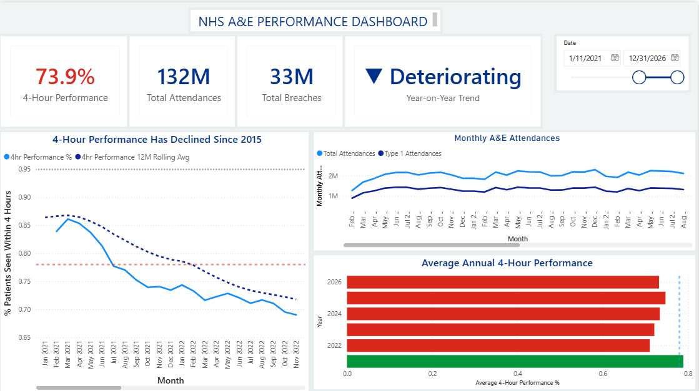
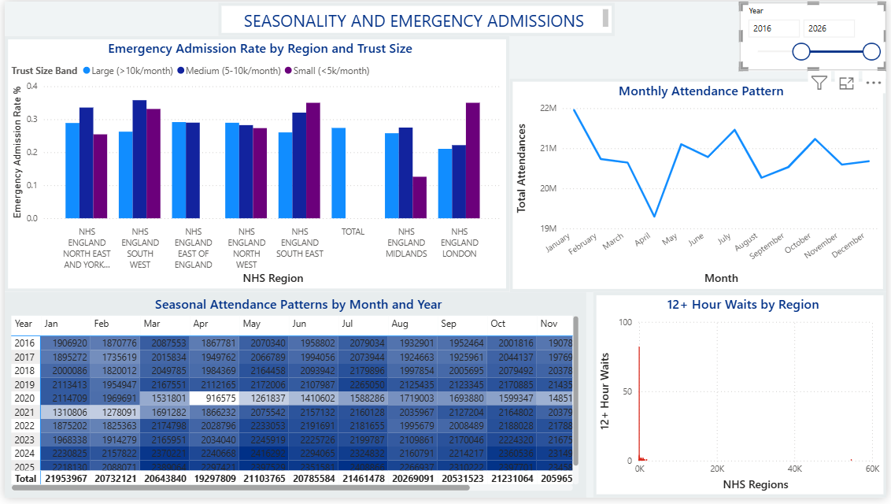
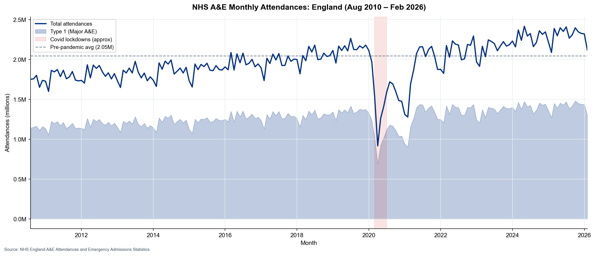
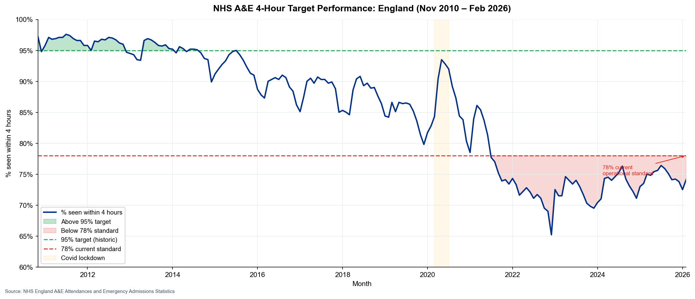
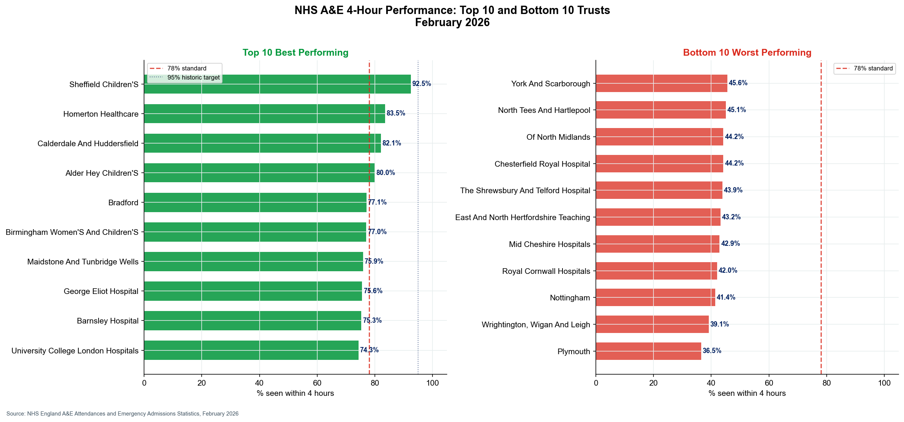
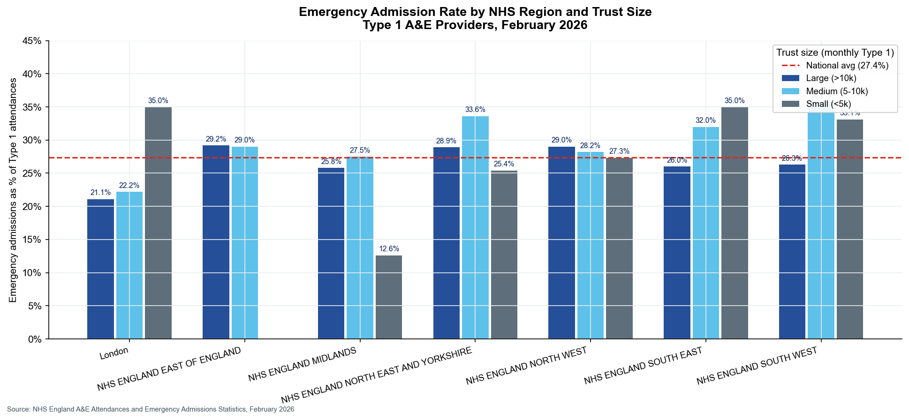

# NHS A&E Performance Dashboard

An end-to-end data analytics project analysing NHS England A&E waiting time performance using SQL Server, Python, Excel, and Power BI.

## Overview

The NHS 4-hour A&E target requires 95% of patients to be seen, treated, and either admitted or discharged within 4 hours of arrival. This standard has not been consistently met since 2013, and was formally reset to 78% in 2023. As of February 2026, national performance remains below the revised standard, with wide variation across trusts.

The dataset covers 187 months of national data (Aug 2010 to Feb 2026) and 198 NHS organisations at provider level for February 2026.

## Data Source

NHS England, A&E Attendances and Emergency Admissions Statistics: https://www.england.nhs.uk/statistics/statistical-work-areas/ae-waiting-times-and-activity/

## Key Findings

- **National 4-hour performance** peaked above 95% in 2013 and has declined since. As of February 2026 it sits below the revised 78% operational standard.
- **Provider variation is extreme**: the best-performing trusts exceed 95% while the worst fall below 60%, suggesting operational factors beyond system-wide demand.
- **Winter seasonality is structural**: December and January consistently show the highest attendance volumes across every year in the dataset. January average attendances are approximately 15% higher than the summer trough.
- **Larger trusts perform worse** on average than smaller ones, reflecting their role as major acute centres receiving the most complex cases.
- **Emergency admission rates vary by region**, with meaningful variation in the proportion of Type 1 attendees subsequently admitted, with implications for bed capacity planning.

## Tools Used

SQL Server, Python (pandas, matplotlib, seaborn, xlsxwriter), Excel, Power BI

## Screenshots

### Power BI Dashboard

#### Page 1: National Overview

#### Page 2: Trust Performance

#### Page 3: Seasonality and Admissions

### Python Charts

| Chart | Preview |
|-------|---------|
| Monthly A&E attendances trend |  |
| 4-hour target performance over time |  |
| Top 10 and bottom 10 trusts by performance |  |
| Seasonal attendance heatmap |  |
| Emergency admission rates by region |  |
